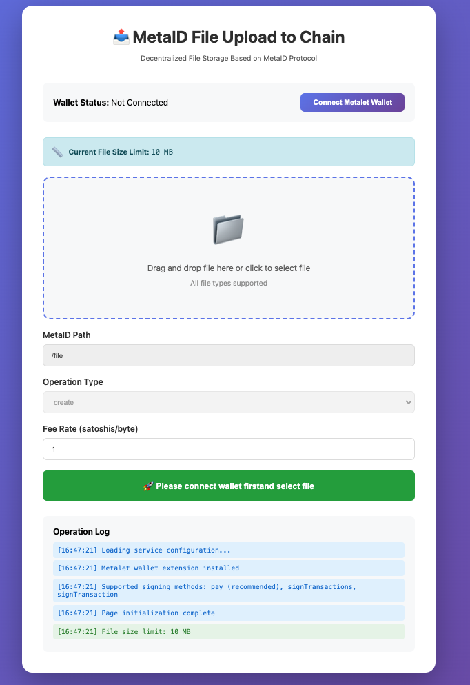

# Meta Media Service

On-chain file service based on MetaID protocol, supporting file upload and indexing capabilities.

[中文版 / Chinese Version](README-ZH.md)

## Features

- 📤 **File Upload**: Upload files to blockchain via MetaID protocol
- 📥 **File Indexing**: Scan and index MetaID files from blockchain
- 🌐 **Web Interface**: Provide visual file upload page with Metalet wallet integration

## Quick Start

### Prerequisites

- Go 1.23+
- MySQL 5.7+
- MVC Node (for indexing service)

### Install Dependencies

```bash
make deps
# or
go mod tidy
```

### Configuration

Copy and modify the configuration file:

```bash
cp conf/conf_example.yaml conf/conf_loc.yaml
```

Edit `conf/conf_loc.yaml` to configure database, blockchain node, storage, etc.

### Initialize Database

```bash
mysql -u root -p < scripts/init.sql
```

Or use Make command:

```bash
make init-db
```

### Build

```bash
# Build all services
make build

# Or use script
chmod +x scripts/build.sh
./scripts/build.sh
```

### Run

#### Run Indexer Service

The indexer service includes two functions:
1. Background indexing of blockchain data
2. Provide query and download API (port 7281)

```bash
# Use compiled binary
./bin/indexer --config=conf/conf_loc.yaml

# Or run directly
make run-indexer
```

#### Run Uploader Service

The uploader service provides file upload API (port 7282)

```bash
# Use compiled binary
./bin/uploader --config=conf/conf_loc.yaml

# Or run directly
make run-uploader
```

#### Run Both Services

```bash
# Terminal 1 - Indexer service
./bin/indexer --config=conf/conf_loc.yaml

# Terminal 2 - Uploader service
./bin/uploader --config=conf/conf_loc.yaml
```

### Web Upload Interface

After starting the Uploader service, you can access the visual upload page through browser:

```bash
# Access upload page
open http://localhost:7282
```

**Web Interface Preview:**



**Features**:
- 🔗 Connect to Metalet wallet
- 📁 Drag and drop file upload
- ⚙️ Configure on-chain parameters
- ✍️ Automatically call wallet for signing
- 📡 One-click upload to blockchain

## 📚 Documentation

- **[📤 Upload Flow Guide (English)](./UPLOAD_FLOW.md)** - Complete guide for uploading files to blockchain with detailed steps and flow diagrams, combined with wallet operations

### Docker Deployment

Docker Compose is recommended for quick deployment.

**Prerequisites**: Need to prepare MySQL database first (standalone deployment or use cloud database)

#### Full Deployment (Indexer + Uploader)

```bash
# Method 1: Use Makefile
make docker-up

# Method 2: Use docker-compose
cd deploy
docker-compose up -d
```

**Configure Database Connection**:

Edit `conf/conf_pro.yaml` to configure database DSN:

```yaml
rds:
  # Use Docker MySQL container
  dsn: "user:pass@tcp(mysql:3306)/metaid_media_db?charset=utf8mb4"

```

#### Deploy Uploader Only

```bash
# Use Makefile
make docker-up-uploader

# Use docker-compose
cd deploy
docker-compose -f docker-compose.uploader.yml up -d

# Use deployment script
cd deploy
./deploy.sh up uploader
```

#### Deploy Indexer Only

```bash
# Use Makefile
make docker-up-indexer

# Use docker-compose
cd deploy
docker-compose -f docker-compose.indexer.yml up -d

# Use deployment script
cd deploy
./deploy.sh up indexer
```

**View Logs**:
```bash
make docker-logs
# or
cd deploy && ./deploy.sh logs all
```

Detailed instructions: [Docker Deployment Documentation](deploy/README.md) | [Quick Start](deploy/QUICKSTART.md)

## API Documentation

### API Module Division

Two services provide different API endpoints:

| Service | Port | API Functions | Swagger Docs |
|---------|------|---------------|--------------|
| **Uploader** | 7282 | File upload, config query | http://localhost:7282/swagger/index.html |
| **Indexer** | 7281 | File query, download | Coming Soon |

### 📚 Swagger API Documentation

#### Uploader API Documentation (v1.0)

The Uploader service provides complete Swagger interactive API documentation.

**Access URL:**
```
http://localhost:7282/swagger/index.html
```

**API Endpoint List:**

1. **File Upload**
   - `POST /api/v1/files/pre-upload` - Pre-upload file, generate unsigned transaction
   - `POST /api/v1/files/commit-upload` - Submit signed transaction, broadcast to chain

2. **Config Query**
   - `GET /api/v1/config` - Get service configuration (e.g., max file size)

**Response Structure:**

All APIs return a unified response format:
```json
{
  "code": 0,           // Response code: 0=success, 40000=param error, 40400=not found, 50000=server error
  "message": "success", // Response message
  "processingTime": 123, // Request processing time (milliseconds)
  "data": {}           // Response data (varies by endpoint)
}
```

**Indexer API Documentation:** Coming soon...

### Pre-upload File (Uploader Service)

Step 1: Pre-upload, build unsigned transaction

```bash
POST http://localhost:7282/api/v1/files/pre-upload
Content-Type: multipart/form-data

Parameters:
- file: File content (binary)
- path: MetaID path
- metaId: MetaID (optional)
- address: Address (optional)
- operation: Operation type (create/modify/revoke, default: create)
- contentType: Content type (optional)
- changeAddress: Change address (optional)
- feeRate: Fee rate (optional, default: 1)
- outputs: Output list JSON (optional)
- otherOutputs: Other output list JSON (optional)

Response:
{
  "code": 0,
  "message": "success",
  "processingTime": 123,
  "data": {
    "fileId": "metaid_abc123...",        // File ID (unique identifier)
    "fileMd5": "5d41402abc4b2a76...",     // File MD5
    "fileHash": "2c26b46b68ffc68f...",    // File SHA256 hash
    "txId": "abc123...",                   // Transaction ID
    "pinId": "abc123...i0",                // Pin ID
    "preTxRaw": "0100000...",              // Pre-transaction raw data (hex, to be signed)
    "status": "pending",                   // Status: pending/success/failed
    "message": "success",                  // Message
    "calTxFee": 1000,                      // Calculated transaction fee (satoshi)
    "calTxSize": 500                       // Calculated transaction size (bytes)
  }
}
```

### Commit Upload (Uploader Service)

Step 2: Submit signed transaction

```bash
POST http://localhost:7282/api/v1/files/commit-upload
Content-Type: application/json

Request:
{
  "fileId": "metaid_abc123...",           // File ID (from pre-upload response)
  "signedRawTx": "0100000..."             // Signed raw transaction data (hex)
}

Response:
{
  "code": 0,
  "message": "success",
  "processingTime": 456,
  "data": {
    "fileId": "metaid_abc123...",         // File ID
    "status": "success",                   // Status: success/failed
    "txId": "abc123...",                   // Transaction ID
    "pinId": "abc123...i0",                // Pin ID
    "message": "success"                   // Message
  }
}
```


## Configuration

### Database Configuration

```yaml
rds:
  dsn: "user:password@tcp(host:3306)/database?charset=utf8mb4&parseTime=True"
  max_open_conns: 1000
  max_idle_conns: 50
```

### Blockchain Configuration

```yaml
chain:
  rpc_url: "http://127.0.0.1:9882"
  rpc_user: "rpcuser"
  rpc_pass: "rpcpassword"
  start_height: 0  # Indexing start height
```

### Storage Configuration

#### Local Storage

```yaml
storage:
  type: "local"
  local:
    base_path: "./data/files"
```

#### Alibaba Cloud OSS

```yaml
storage:
  type: "oss"
  oss:
    endpoint: "oss-cn-hangzhou.aliyuncs.com"
    access_key: "your-access-key"
    secret_key: "your-secret-key"
    bucket: "your-bucket"
```

### Indexer Configuration

```yaml
indexer:
  enabled: true
  scan_interval: 10  # Scan interval (seconds)
  batch_size: 100    # Batch processing size
  start_height: 0    # Start height (0 = start from max height in database)
```

### Uploader Configuration

```yaml
uploader:
  enabled: true
  max_file_size: 10  # Max file size (10MB)
  fee_rate: 1              # Default fee rate
```

## Development

### Run Tests

```bash
make test
```

### Clean Build Artifacts

```bash
make clean
```

## License

MIT License

## Version Information

**Current Version: v0.1.0**

### Changelog

#### v0.1.0 (2025-10-16)

**Uploader Service**
- ✅ Complete file upload functionality (pre-upload + commit upload)
- ✅ Comprehensive Swagger API documentation
- ✅ Web visual upload interface (Metalet wallet integration)

**Indexer Service**
- 🚧 In development... 
