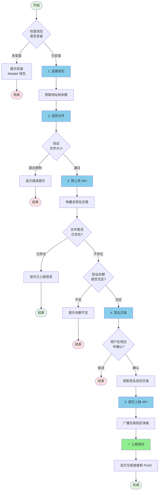

# 📤 MetaID 文件上链流程详解

本文档详细说明如何使用 Meta Media Uploader 将文件上传到区块链。

## 📋 目录

- [流程概览](#流程概览)
- [详细步骤](#详细步骤)
  - [步骤 1: 连接 Metalet 钱包](#步骤-1-连接-metalet-钱包)
  - [步骤 2: 选择文件](#步骤-2-选择文件)
  - [步骤 3: 预上传（Pre-Upload）](#步骤-3-预上传pre-upload)
  - [步骤 4: 签名交易](#步骤-4-签名交易)
  - [步骤 5: 提交上链（Commit）](#步骤-5-提交上链commit)
- [API 接口说明](#api-接口说明)
- [代码示例](#代码示例)
- [常见问题](#常见问题)

---

## 🎯 流程概览

整个文件上链流程分为 5 个主要步骤：



---

## 📝 详细步骤

### 步骤 1: 连接 Metalet 钱包

#### 1.1 检查钱包插件

首先检查用户是否已安装 Metalet 钱包浏览器插件：

```javascript
// 检查钱包是否已安装
if (typeof window.metaidwallet === 'undefined') {
    alert('请先安装 Metalet 钱包插件！');
    window.open('https://www.metalet.space/', '_blank');
    return;
}
```

#### 1.2 连接钱包

调用钱包的 `connect()` 方法请求用户授权：

```javascript
// 连接钱包
const account = await window.metaidwallet.connect();

// 获取地址（兼容不同版本的钱包 API）
const address = account.address || account.mvcAddress || account.btcAddress;

console.log('钱包地址:', address);
```

#### 1.3 获取余额

连接成功后，获取用户的钱包余额：

```javascript
// 获取余额
const balance = await window.metaidwallet.getBalance();

console.log('总余额:', balance.total, 'satoshis');
console.log('已确认:', balance.confirmed, 'satoshis');
console.log('未确认:', balance.unconfirmed, 'satoshis');
```

#### 1.4 计算 MetaID

使用地址的 SHA256 哈希作为 MetaID：

```javascript
async function calculateMetaID(address) {
    const encoder = new TextEncoder();
    const data = encoder.encode(address);
    const hashBuffer = await crypto.subtle.digest('SHA-256', data);
    const hashArray = Array.from(new Uint8Array(hashBuffer));
    const hashHex = hashArray.map(b => b.toString(16).padStart(2, '0')).join('');
    return hashHex;
}

const metaId = await calculateMetaID(address);
console.log('MetaID:', metaId);
```

---

### 步骤 2: 选择文件

#### 2.1 文件选择

用户通过拖放或点击选择要上传的文件：

```javascript
// 处理文件选择
function handleFile(file) {
    // 验证文件大小
    if (file.size > maxFileSize) {
        alert(`文件过大！最大限制: ${formatFileSize(maxFileSize)}`);
        return;
    }
    
    selectedFile = file;
    console.log('文件已选择:', file.name, formatFileSize(file.size));
}
```

#### 2.2 构建 ContentType

为文件构建正确的 ContentType（类型 + ;binary 后缀）：

```javascript
// 构建 ContentType
let contentType = file.type || 'application/octet-stream';
if (!contentType.includes(';binary')) {
    contentType = contentType + ';binary';
}

// 示例：
// - image/png → image/png;binary
// - application/pdf → application/pdf;binary
// - text/plain → text/plain;binary
```

---

### 步骤 3: 预上传（Pre-Upload）

预上传阶段会将文件上传到服务器，服务器会构建一个未签名的区块链交易。

#### 3.1 API 调用

```javascript
// POST /api/v1/files/pre-upload
const formData = new FormData();
formData.append('file', selectedFile);                    // 文件内容
formData.append('path', '/file');                         // 文件路径
formData.append('operation', 'create');                   // 操作类型
formData.append('contentType', contentType);              // 内容类型
formData.append('feeRate', 1);                           // 费率（satoshis/byte）
formData.append('metaId', metaId);                       // MetaID
formData.append('address', address);                      // 用户地址
formData.append('outputs', JSON.stringify([              // 输出列表
    { address: address, amount: 1 }
]));
formData.append('otherOutputs', '[]');                   // 其他输出

const response = await fetch('/api/v1/files/pre-upload', {
    method: 'POST',
    body: formData
});

const result = await response.json();
```

#### 3.2 响应数据

```json
{
    "code": 0,
    "message": "success",
    "data": {
        "fileId": "metaid_abc123",                    // 文件 ID
        "fileMd5": "5d41402abc4b2a76b9719d911017c592", // 文件 MD5
        "fileHash": "2c26b46b68ffc68ff...",           // 文件 SHA256
        "txId": "abc123...",                          // 交易 ID（预生成）
        "pinId": "abc123...i0",                       // Pin ID
        "preTxRaw": "0100000...",                     // 未签名交易（hex）
        "status": "pending",                          // 状态
        "calTxFee": 1000,                            // 预计交易费用（satoshis）
        "calTxSize": 500                             // 预计交易大小（bytes）
    }
}
```

#### 3.3 特殊情况处理

如果文件已经存在，`status` 会返回 `"success"`，无需继续后续步骤：

```javascript
if (result.data.status === 'success') {
    console.log('文件已存在，无需重复上传！');
    console.log('交易 ID:', result.data.txId);
    console.log('Pin ID:', result.data.pinId);
    return;
}
```

---

### 步骤 4: 签名交易

使用 Metalet 钱包的 `pay` 方法对交易进行签名和支付。

#### 4.1 加载 meta-contract 库

页面中需要引入 `meta-contract` 库（已在 index.html 中引入）：

```html
<script src="/static/metacontract.min.js"></script>
```

#### 4.2 解析未签名交易

```javascript
// 获取 meta-contract 库
const metaContract = window.metaContract;
const mvc = metaContract.mvc;
const TxComposer = metaContract.TxComposer;

// 从 hex 创建 Transaction
const tx = new mvc.Transaction(preTxRaw);

// 创建 TxComposer
const txComposer = new TxComposer(tx);

// 序列化 TxComposer
const txComposerSerialize = txComposer.serialize();
```

#### 4.3 调用 pay 方法签名

```javascript
// 构建 pay 参数
const payParams = {
    transactions: [
        {
            txComposer: txComposerSerialize,
            message: 'Upload File to MetaID',
        }
    ],
    feeb: 1, // 费率
};

// 调用钱包签名（会弹出钱包确认窗口）
const payResult = await window.metaidwallet.pay(payParams);

// 解析签名结果
const payedTxComposerStr = payResult.payedTransactions[0];
const payedTxComposer = TxComposer.deserialize(payedTxComposerStr);

// 获取签名后的交易 hex
const signedRawTx = payedTxComposer.getRawHex();

console.log('交易已签名:', signedRawTx);
```

#### 4.4 用户确认

在这一步，Metalet 钱包会弹出确认窗口，用户需要：

1. 查看交易详情（接收地址、金额、手续费等）
2. 输入密码（如果需要）
3. 点击「确认」按钮

如果用户点击「取消」，会抛出异常：

```javascript
try {
    const payResult = await window.metaidwallet.pay(payParams);
    // ...
} catch (error) {
    if (error.message.includes('User canceled')) {
        console.log('用户取消了签名');
    }
}
```

---

### 步骤 5: 提交上链（Commit）

将签名后的交易提交给服务器，服务器会广播到区块链网络。

#### 5.1 API 调用

```javascript
// POST /api/v1/files/commit-upload
const response = await fetch('/api/v1/files/commit-upload', {
    method: 'POST',
    headers: {
        'Content-Type': 'application/json'
    },
    body: JSON.stringify({
        fileId: fileId,           // 步骤 3 返回的 fileId
        signedRawTx: signedRawTx  // 步骤 4 签名后的交易
    })
});

const result = await response.json();
```

#### 5.2 响应数据

```json
{
    "code": 0,
    "message": "success",
    "data": {
        "fileId": "metaid_abc123",
        "status": "success",
        "txId": "abc123...",      // 实际的交易 ID
        "pinId": "abc123...i0",   // Pin ID
        "message": "success"
    }
}
```

#### 5.3 查看结果

上链成功后，可以通过以下链接查看：

```javascript
// 交易浏览器
const txUrl = `https://www.mvcscan.com/tx/${txId}`;

// MetaID Pin 浏览器
const pinUrl = `https://man.metaid.io/pin/${pinId}`;

console.log('📝 查看交易:', txUrl);
console.log('📌 查看 Pin:', pinUrl);
```

---

## 🔌 API 接口说明

### 1. 获取配置

获取上传服务的配置信息（如最大文件大小）。

```http
GET /api/v1/config
```

**响应示例：**

```json
{
    "code": 0,
    "message": "success",
    "data": {
        "maxFileSize": 10485760
    }
}
```

---

### 2. 预上传

上传文件并生成未签名交易。

```http
POST /api/v1/files/pre-upload
Content-Type: multipart/form-data
```

**请求参数：**

| 参数 | 类型 | 必填 | 说明 |
|------|------|------|------|
| file | File | 是 | 要上传的文件 |
| path | String | 是 | 文件路径（如：`/file`） |
| operation | String | 否 | 操作类型（默认：`create`） |
| contentType | String | 否 | 内容类型（建议加 `;binary` 后缀） |
| metaId | String | 是 | 用户的 MetaID（地址的 SHA256） |
| address | String | 是 | 用户的区块链地址 |
| feeRate | Integer | 否 | 费率（satoshis/byte，默认：1） |
| outputs | String | 否 | 输出列表 JSON 字符串 |
| otherOutputs | String | 否 | 其他输出列表 JSON 字符串 |

**响应示例：**

```json
{
    "code": 0,
    "message": "success",
    "data": {
        "fileId": "metaid_abc123",
        "fileMd5": "5d41402abc4b2a76b9719d911017c592",
        "fileHash": "2c26b46b68ffc68ff99b453c1d30413413422d706483bfa0f98a5e886266e7ae",
        "txId": "预生成的交易ID",
        "pinId": "abc123...i0",
        "preTxRaw": "0100000...",
        "status": "pending",
        "message": "success",
        "calTxFee": 1000,
        "calTxSize": 500
    }
}
```

---

### 3. 提交上链

提交签名后的交易进行广播。

```http
POST /api/v1/files/commit-upload
Content-Type: application/json
```

**请求参数：**

```json
{
    "fileId": "metaid_abc123",
    "signedRawTx": "0100000..."
}
```

**响应示例：**

```json
{
    "code": 0,
    "message": "success",
    "data": {
        "fileId": "metaid_abc123",
        "status": "success",
        "txId": "实际的交易ID",
        "pinId": "abc123...i0",
        "message": "success"
    }
}
```

---

## 💻 代码示例

### 完整的上传流程代码

```javascript
/**
 * 完整的文件上链流程
 */
async function uploadFileToChain(file) {
    try {
        // 1. 连接钱包
        const account = await window.metaidwallet.connect();
        const address = account.address || account.mvcAddress;
        const metaId = await calculateMetaID(address);
        
        console.log('✅ 钱包已连接:', address);
        
        // 2. 构建 ContentType
        let contentType = file.type || 'application/octet-stream';
        if (!contentType.includes(';binary')) {
            contentType = contentType + ';binary';
        }
        
        // 3. 预上传
        const formData = new FormData();
        formData.append('file', file);
        formData.append('path', '/file');
        formData.append('operation', 'create');
        formData.append('contentType', contentType);
        formData.append('feeRate', 1);
        formData.append('metaId', metaId);
        formData.append('address', address);
        formData.append('outputs', JSON.stringify([
            { address: address, amount: 1 }
        ]));
        formData.append('otherOutputs', '[]');
        
        const preUploadResp = await fetch('/api/v1/files/pre-upload', {
            method: 'POST',
            body: formData
        });
        const preUploadData = await preUploadResp.json();
        
        if (preUploadData.code !== 0) {
            throw new Error(preUploadData.message);
        }
        
        // 检查文件是否已存在
        if (preUploadData.data.status === 'success') {
            console.log('✅ 文件已存在！');
            console.log('TxID:', preUploadData.data.txId);
            return preUploadData.data;
        }
        
        console.log('✅ 预上传成功');
        
        // 4. 签名交易
        const metaContract = window.metaContract;
        const mvc = metaContract.mvc;
        const TxComposer = metaContract.TxComposer;
        
        const tx = new mvc.Transaction(preUploadData.data.preTxRaw);
        const txComposer = new TxComposer(tx);
        const txComposerSerialize = txComposer.serialize();
        
        const payParams = {
            transactions: [{
                txComposer: txComposerSerialize,
                message: 'Upload File to MetaID',
            }],
            feeb: 1,
        };
        
        const payResult = await window.metaidwallet.pay(payParams);
        const payedTxComposer = TxComposer.deserialize(payResult.payedTransactions[0]);
        const signedRawTx = payedTxComposer.getRawHex();
        
        console.log('✅ 交易已签名');
        
        // 5. 提交上链
        const commitResp = await fetch('/api/v1/files/commit-upload', {
            method: 'POST',
            headers: { 'Content-Type': 'application/json' },
            body: JSON.stringify({
                fileId: preUploadData.data.fileId,
                signedRawTx: signedRawTx
            })
        });
        const commitData = await commitResp.json();
        
        if (commitData.code !== 0) {
            throw new Error(commitData.message);
        }
        
        console.log('✅ 上链成功！');
        console.log('TxID:', commitData.data.txId);
        console.log('PinID:', commitData.data.pinId);
        
        return commitData.data;
        
    } catch (error) {
        console.error('❌ 上链失败:', error.message);
        throw error;
    }
}

// 使用示例
const fileInput = document.getElementById('fileInput');
fileInput.addEventListener('change', async (e) => {
    const file = e.target.files[0];
    if (file) {
        try {
            const result = await uploadFileToChain(file);
            alert('上链成功！TxID: ' + result.txId);
        } catch (error) {
            alert('上链失败: ' + error.message);
        }
    }
});
```

---

## ❓ 常见问题

### Q1: 为什么需要 ContentType 加 `;binary` 后缀？

**A:** 这是 MetaID 协议的规范要求。`;binary` 后缀表示文件内容是二进制格式存储的。即使是文本文件（如 `text/plain`），存储到链上也是以二进制形式存储的，因此需要加上这个后缀。

**示例：**
- `image/png` → `image/png;binary`
- `application/pdf` → `application/pdf;binary`
- `text/plain` → `text/plain;binary`

---

### Q2: 如何计算需要的手续费？

**A:** 服务器会在预上传阶段自动计算所需的交易费用，并在响应中返回 `calTxFee` 和 `calTxSize`：

```javascript
const preUploadData = await preUpload();
console.log('预计手续费:', preUploadData.calTxFee, 'satoshis');
console.log('交易大小:', preUploadData.calTxSize, 'bytes');
console.log('费率:', preUploadData.calTxFee / preUploadData.calTxSize, 'sat/byte');
```

建议在签名前验证用户余额是否充足：

```javascript
const balance = await window.metaidwallet.getBalance();
const availableBalance = Math.floor(balance.total * 0.8); // 使用 80% 的余额

if (availableBalance < preUploadData.calTxFee) {
    throw new Error(`余额不足！需要 ${preUploadData.calTxFee} satoshis`);
}
```

---

### Q3: 签名时用户取消了怎么办？

**A:** 用户在钱包中点击「取消」会抛出异常，需要捕获处理：

```javascript
try {
    const payResult = await window.metaidwallet.pay(payParams);
    // 签名成功...
} catch (error) {
    if (error.message && (
        error.message.includes('User canceled') ||
        error.message.includes('user cancelled') ||
        error.message.includes('User rejected')
    )) {
        console.log('用户取消了签名');
        // 显示友好提示
    } else {
        console.error('签名失败:', error);
    }
}
```

---

### Q4: 如何验证文件是否已上链成功？

**A:** 提交上链成功后会返回 `txId` 和 `pinId`，可以通过以下方式验证：

1. **区块链浏览器查询交易：**
   ```
   https://www.mvcscan.com/tx/{txId}
   ```

2. **MetaID Pin 浏览器：**
   ```
   https://man.metaid.io/pin/{pinId}
   ```

3. **通过 Indexer API 查询：**
   ```javascript
   const response = await fetch(`/api/v1/files/${txId}`);
   const result = await response.json();
   console.log('文件信息:', result.data);
   ```

---

### Q5: 文件大小有限制吗？

**A:** 是的，服务器会限制最大文件大小。可以通过配置接口获取：

```javascript
const response = await fetch('/api/v1/config');
const config = await response.json();
console.log('最大文件大小:', config.data.maxFileSize, 'bytes');
// 通常是 10MB (10485760 bytes)
```

如果需要上传更大的文件，需要：
1. 修改服务器配置文件 `conf/conf_pro.yaml` 中的 `uploader.max_file_size`
2. 重启服务

---

### Q6: 为什么需要 outputs 参数？

**A:** `outputs` 参数定义了交易的输出地址和金额。通常设置为自己的地址和 1 satoshi：

```javascript
const outputs = [
    { address: userAddress, amount: 1 }
];
```

这样做的目的是：
1. 将文件数据关联到你的地址
2. 创建一个可查询的 UTXO
3. 金额设为 1 satoshi 可以最小化成本

---

### Q7: 上链失败了怎么办？

**A:** 上链失败可能有多种原因：

1. **余额不足：**
   ```
   解决：充值钱包，确保余额 > 预估手续费
   ```

2. **文件已存在：**
   ```
   解决：检查 preUpload 返回的 status，如果是 "success" 说明已上链
   ```

3. **网络问题：**
   ```
   解决：检查区块链网络是否正常，稍后重试
   ```

4. **签名失败：**
   ```
   解决：确保 meta-contract 库已正确加载，钱包版本是最新的
   ```

可以查看控制台日志和网络请求详情来定位具体问题。

---

## 🔗 相关链接

- **Metalet 钱包下载：** https://www.metalet.space/
- **MetaID 文档：** https://docs.metaid.io/
- **MVC 区块链浏览器：** https://www.mvcscan.com/
- **MetaID Pin 浏览器：** https://man.metaid.io/
- **GitHub 仓库：** https://github.com/metaid-developers/meta-media-service

---

## 📞 技术支持

如有问题，请联系：

- 提交 Issue: https://github.com/metaid-developers/meta-media-service/issues

---

**最后更新时间：** 2025-10-17

