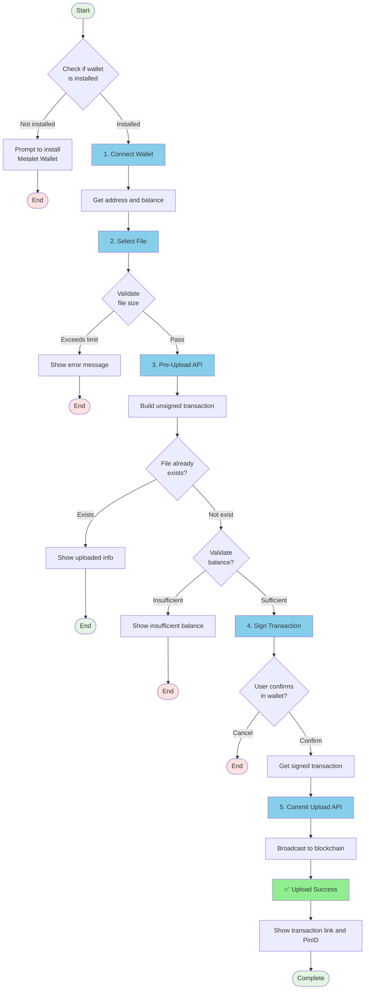

# 📤 MetaID File Upload to Chain - Complete Guide

This document provides a detailed explanation of how to upload files to the blockchain using Meta Media Uploader.

**[中文版 / Chinese Version](./UPLOAD_FLOW-ZH.md)**

## 📋 Table of Contents

- [Process Overview](#process-overview)
- [Detailed Steps](#detailed-steps)
  - [Step 1: Connect Metalet Wallet](#step-1-connect-metalet-wallet)
  - [Step 2: Select File](#step-2-select-file)
  - [Step 3: Pre-Upload](#step-3-pre-upload)
  - [Step 4: Sign Transaction](#step-4-sign-transaction)
  - [Step 5: Commit to Chain](#step-5-commit-to-chain)
- [API Reference](#api-reference)
- [Code Examples](#code-examples)
- [FAQ](#faq)

---

## 🎯 Process Overview

The entire file upload to chain process consists of 5 main steps:



---

## 📝 Detailed Steps

### Step 1: Connect Metalet Wallet

#### 1.1 Check Wallet Extension

First, check if the user has installed the Metalet wallet browser extension:

```javascript
// Check if wallet is installed
if (typeof window.metaidwallet === 'undefined') {
    alert('Please install Metalet wallet extension first!');
    window.open('https://www.metalet.space/', '_blank');
    return;
}
```

#### 1.2 Connect to Wallet

Call the wallet's `connect()` method to request user authorization:

```javascript
// Connect wallet
const account = await window.metaidwallet.connect();

// Get address (compatible with different wallet API versions)
const address = account.address || account.mvcAddress || account.btcAddress;

console.log('Wallet address:', address);
```

#### 1.3 Get Balance

After successful connection, retrieve the user's wallet balance:

```javascript
// Get balance
const balance = await window.metaidwallet.getBalance();

console.log('Total balance:', balance.total, 'satoshis');
console.log('Confirmed:', balance.confirmed, 'satoshis');
console.log('Unconfirmed:', balance.unconfirmed, 'satoshis');
```

#### 1.4 Calculate MetaID

Use the SHA256 hash of the address as the MetaID:

```javascript
async function calculateMetaID(address) {
    const encoder = new TextEncoder();
    const data = encoder.encode(address);
    const hashBuffer = await crypto.subtle.digest('SHA-256', data);
    const hashArray = Array.from(new Uint8Array(hashBuffer));
    const hashHex = hashArray.map(b => b.toString(16).padStart(2, '0')).join('');
    return hashHex;
}

const metaId = await calculateMetaID(address);
console.log('MetaID:', metaId);
```

---

### Step 2: Select File

#### 2.1 File Selection

Users select files to upload via drag-and-drop or clicking:

```javascript
// Handle file selection
function handleFile(file) {
    // Validate file size
    if (file.size > maxFileSize) {
        alert(`File too large! Maximum limit: ${formatFileSize(maxFileSize)}`);
        return;
    }
    
    selectedFile = file;
    console.log('File selected:', file.name, formatFileSize(file.size));
}
```

#### 2.2 Build ContentType

Build the correct ContentType for the file (type + ;binary suffix):

```javascript
// Build ContentType
let contentType = file.type || 'application/octet-stream';
if (!contentType.includes(';binary')) {
    contentType = contentType + ';binary';
}

// Examples:
// - image/png → image/png;binary
// - application/pdf → application/pdf;binary
// - text/plain → text/plain;binary
```

---

### Step 3: Pre-Upload

The pre-upload stage uploads the file to the server, which then builds an unsigned blockchain transaction.

#### 3.1 API Call

```javascript
// POST /api/v1/files/pre-upload
const formData = new FormData();
formData.append('file', selectedFile);                    // File content
formData.append('path', '/file');                         // File path
formData.append('operation', 'create');                   // Operation type
formData.append('contentType', contentType);              // Content type
formData.append('feeRate', 1);                           // Fee rate (satoshis/byte)
formData.append('metaId', metaId);                       // MetaID
formData.append('address', address);                      // User address
formData.append('outputs', JSON.stringify([              // Output list
    { address: address, amount: 1 }
]));
formData.append('otherOutputs', '[]');                   // Other outputs

const response = await fetch('/api/v1/files/pre-upload', {
    method: 'POST',
    body: formData
});

const result = await response.json();
```

#### 3.2 Response Data

```json
{
    "code": 0,
    "message": "success",
    "data": {
        "fileId": "metaid_abc123",                    // File ID
        "fileMd5": "5d41402abc4b2a76b9719d911017c592", // File MD5
        "fileHash": "2c26b46b68ffc68ff...",           // File SHA256
        "txId": "abc123...",                          // Transaction ID (pre-generated)
        "pinId": "abc123...i0",                       // Pin ID
        "preTxRaw": "0100000...",                     // Unsigned transaction (hex)
        "status": "pending",                          // Status
        "calTxFee": 1000,                            // Calculated transaction fee (satoshis)
        "calTxSize": 500                             // Calculated transaction size (bytes)
    }
}
```

#### 3.3 Special Case Handling

If the file already exists, `status` will return `"success"`, and no further steps are needed:

```javascript
if (result.data.status === 'success') {
    console.log('File already exists, no need to re-upload!');
    console.log('Transaction ID:', result.data.txId);
    console.log('Pin ID:', result.data.pinId);
    return;
}
```

---

### Step 4: Sign Transaction

Use Metalet wallet's `pay` method to sign and pay for the transaction.

#### 4.1 Load meta-contract Library

The page needs to include the `meta-contract` library (already included in index.html):

```html
<script src="/static/metacontract.min.js"></script>
```

#### 4.2 Parse Unsigned Transaction

```javascript
// Get meta-contract library
const metaContract = window.metaContract;
const mvc = metaContract.mvc;
const TxComposer = metaContract.TxComposer;

// Create Transaction from hex
const tx = new mvc.Transaction(preTxRaw);

// Create TxComposer
const txComposer = new TxComposer(tx);

// Serialize TxComposer
const txComposerSerialize = txComposer.serialize();
```

#### 4.3 Call pay Method to Sign

```javascript
// Build pay parameters
const payParams = {
    transactions: [
        {
            txComposer: txComposerSerialize,
            message: 'Upload File to MetaID',
        }
    ],
    feeb: 1, // Fee rate
};

// Call wallet to sign (will open wallet confirmation window)
const payResult = await window.metaidwallet.pay(payParams);

// Parse signing result
const payedTxComposerStr = payResult.payedTransactions[0];
const payedTxComposer = TxComposer.deserialize(payedTxComposerStr);

// Get signed transaction hex
const signedRawTx = payedTxComposer.getRawHex();

console.log('Transaction signed:', signedRawTx);
```

#### 4.4 User Confirmation

At this step, the Metalet wallet will open a confirmation window where the user needs to:

1. Review transaction details (recipient address, amount, fees, etc.)
2. Enter password (if required)
3. Click the "Confirm" button

If the user clicks "Cancel", an exception will be thrown:

```javascript
try {
    const payResult = await window.metaidwallet.pay(payParams);
    // Signing successful...
} catch (error) {
    if (error.message.includes('User canceled')) {
        console.log('User canceled signing');
    }
}
```

---

### Step 5: Commit to Chain

Submit the signed transaction to the server, which will broadcast it to the blockchain network.

#### 5.1 API Call

```javascript
// POST /api/v1/files/commit-upload
const response = await fetch('/api/v1/files/commit-upload', {
    method: 'POST',
    headers: {
        'Content-Type': 'application/json'
    },
    body: JSON.stringify({
        fileId: fileId,           // fileId from step 3
        signedRawTx: signedRawTx  // signed transaction from step 4
    })
});

const result = await response.json();
```

#### 5.2 Response Data

```json
{
    "code": 0,
    "message": "success",
    "data": {
        "fileId": "metaid_abc123",
        "status": "success",
        "txId": "abc123...",      // Actual transaction ID
        "pinId": "abc123...i0",   // Pin ID
        "message": "success"
    }
}
```

#### 5.3 View Results

After successful upload to chain, you can view via the following links:

```javascript
// Blockchain explorer
const txUrl = `https://www.mvcscan.com/tx/${txId}`;

// MetaID Pin explorer
const pinUrl = `https://man.metaid.io/pin/${pinId}`;

console.log('📝 View transaction:', txUrl);
console.log('📌 View Pin:', pinUrl);
```

---

## 🔌 API Reference

### 1. Get Configuration

Get upload service configuration information (such as maximum file size).

```http
GET /api/v1/config
```

**Response Example:**

```json
{
    "code": 0,
    "message": "success",
    "data": {
        "maxFileSize": 10485760
    }
}
```

---

### 2. Pre-Upload

Upload file and generate unsigned transaction.

```http
POST /api/v1/files/pre-upload
Content-Type: multipart/form-data
```

**Request Parameters:**

| Parameter | Type | Required | Description |
|-----------|------|----------|-------------|
| file | File | Yes | File to upload |
| path | String | Yes | File path (e.g., `/file`) |
| operation | String | No | Operation type (default: `create`) |
| contentType | String | No | Content type (recommended with `;binary` suffix) |
| metaId | String | Yes | User's MetaID (SHA256 of address) |
| address | String | Yes | User's blockchain address |
| feeRate | Integer | No | Fee rate (satoshis/byte, default: 1) |
| outputs | String | No | Output list JSON string |
| otherOutputs | String | No | Other outputs list JSON string |

**Response Example:**

```json
{
    "code": 0,
    "message": "success",
    "data": {
        "fileId": "metaid_abc123",
        "fileMd5": "5d41402abc4b2a76b9719d911017c592",
        "fileHash": "2c26b46b68ffc68ff99b453c1d30413413422d706483bfa0f98a5e886266e7ae",
        "txId": "pre-generated transaction ID",
        "pinId": "abc123...i0",
        "preTxRaw": "0100000...",
        "status": "pending",
        "message": "success",
        "calTxFee": 1000,
        "calTxSize": 500
    }
}
```

---

### 3. Commit Upload

Submit signed transaction for broadcast.

```http
POST /api/v1/files/commit-upload
Content-Type: application/json
```

**Request Parameters:**

```json
{
    "fileId": "metaid_abc123",
    "signedRawTx": "0100000..."
}
```

**Response Example:**

```json
{
    "code": 0,
    "message": "success",
    "data": {
        "fileId": "metaid_abc123",
        "status": "success",
        "txId": "actual transaction ID",
        "pinId": "abc123...i0",
        "message": "success"
    }
}
```

---

## 💻 Code Examples

### Complete Upload Flow Code

```javascript
/**
 * Complete file upload to chain flow
 */
async function uploadFileToChain(file) {
    try {
        // 1. Connect wallet
        const account = await window.metaidwallet.connect();
        const address = account.address || account.mvcAddress;
        const metaId = await calculateMetaID(address);
        
        console.log('✅ Wallet connected:', address);
        
        // 2. Build ContentType
        let contentType = file.type || 'application/octet-stream';
        if (!contentType.includes(';binary')) {
            contentType = contentType + ';binary';
        }
        
        // 3. Pre-upload
        const formData = new FormData();
        formData.append('file', file);
        formData.append('path', '/file');
        formData.append('operation', 'create');
        formData.append('contentType', contentType);
        formData.append('feeRate', 1);
        formData.append('metaId', metaId);
        formData.append('address', address);
        formData.append('outputs', JSON.stringify([
            { address: address, amount: 1 }
        ]));
        formData.append('otherOutputs', '[]');
        
        const preUploadResp = await fetch('/api/v1/files/pre-upload', {
            method: 'POST',
            body: formData
        });
        const preUploadData = await preUploadResp.json();
        
        if (preUploadData.code !== 0) {
            throw new Error(preUploadData.message);
        }
        
        // Check if file already exists
        if (preUploadData.data.status === 'success') {
            console.log('✅ File already exists!');
            console.log('TxID:', preUploadData.data.txId);
            return preUploadData.data;
        }
        
        console.log('✅ Pre-upload successful');
        
        // 4. Sign transaction
        const metaContract = window.metaContract;
        const mvc = metaContract.mvc;
        const TxComposer = metaContract.TxComposer;
        
        const tx = new mvc.Transaction(preUploadData.data.preTxRaw);
        const txComposer = new TxComposer(tx);
        const txComposerSerialize = txComposer.serialize();
        
        const payParams = {
            transactions: [{
                txComposer: txComposerSerialize,
                message: 'Upload File to MetaID',
            }],
            feeb: 1,
        };
        
        const payResult = await window.metaidwallet.pay(payParams);
        const payedTxComposer = TxComposer.deserialize(payResult.payedTransactions[0]);
        const signedRawTx = payedTxComposer.getRawHex();
        
        console.log('✅ Transaction signed');
        
        // 5. Commit upload
        const commitResp = await fetch('/api/v1/files/commit-upload', {
            method: 'POST',
            headers: { 'Content-Type': 'application/json' },
            body: JSON.stringify({
                fileId: preUploadData.data.fileId,
                signedRawTx: signedRawTx
            })
        });
        const commitData = await commitResp.json();
        
        if (commitData.code !== 0) {
            throw new Error(commitData.message);
        }
        
        console.log('✅ Upload to chain successful!');
        console.log('TxID:', commitData.data.txId);
        console.log('PinID:', commitData.data.pinId);
        
        return commitData.data;
        
    } catch (error) {
        console.error('❌ Upload to chain failed:', error.message);
        throw error;
    }
}

// Usage example
const fileInput = document.getElementById('fileInput');
fileInput.addEventListener('change', async (e) => {
    const file = e.target.files[0];
    if (file) {
        try {
            const result = await uploadFileToChain(file);
            alert('Upload successful! TxID: ' + result.txId);
        } catch (error) {
            alert('Upload failed: ' + error.message);
        }
    }
});
```

---

## ❓ FAQ

### Q1: Why does ContentType need the `;binary` suffix?

**A:** This is required by the MetaID protocol specification. The `;binary` suffix indicates that the file content is stored in binary format. Even for text files (like `text/plain`), they are stored on the chain in binary format, so this suffix is required.

**Examples:**
- `image/png` → `image/png;binary`
- `application/pdf` → `application/pdf;binary`
- `text/plain` → `text/plain;binary`

---

### Q2: How to calculate the required transaction fee?

**A:** The server automatically calculates the required transaction fee during the pre-upload stage and returns `calTxFee` and `calTxSize` in the response:

```javascript
const preUploadData = await preUpload();
console.log('Estimated fee:', preUploadData.calTxFee, 'satoshis');
console.log('Transaction size:', preUploadData.calTxSize, 'bytes');
console.log('Fee rate:', preUploadData.calTxFee / preUploadData.calTxSize, 'sat/byte');
```

It's recommended to verify that the user's balance is sufficient before signing:

```javascript
const balance = await window.metaidwallet.getBalance();
const availableBalance = Math.floor(balance.total * 0.8); // Use 80% of balance

if (availableBalance < preUploadData.calTxFee) {
    throw new Error(`Insufficient balance! Need ${preUploadData.calTxFee} satoshis`);
}
```

---

### Q3: What if the user cancels during signing?

**A:** When the user clicks "Cancel" in the wallet, an exception will be thrown that needs to be caught:

```javascript
try {
    const payResult = await window.metaidwallet.pay(payParams);
    // Signing successful...
} catch (error) {
    if (error.message && (
        error.message.includes('User canceled') ||
        error.message.includes('user cancelled') ||
        error.message.includes('User rejected')
    )) {
        console.log('User canceled signing');
        // Show friendly message
    } else {
        console.error('Signing failed:', error);
    }
}
```

---

### Q4: How to verify if the file has been successfully uploaded to chain?

**A:** After successful commit, `txId` and `pinId` will be returned. You can verify through:

1. **Blockchain explorer query:**
   ```
   https://www.mvcscan.com/tx/{txId}
   ```

2. **MetaID Pin explorer:**
   ```
   https://man.metaid.io/pin/{pinId}
   ```

3. **Query via Indexer API:**
   ```javascript
   const response = await fetch(`/api/v1/files/${txId}`);
   const result = await response.json();
   console.log('File info:', result.data);
   ```

---

### Q5: Is there a file size limit?

**A:** Yes, the server will limit the maximum file size. You can get it through the config API:

```javascript
const response = await fetch('/api/v1/config');
const config = await response.json();
console.log('Maximum file size:', config.data.maxFileSize, 'bytes');
// Usually 10MB (10485760 bytes)
```

To upload larger files:
1. Modify `uploader.max_file_size` in server config file `conf/conf_pro.yaml`
2. Restart the service

---

### Q6: Why is the outputs parameter needed?

**A:** The `outputs` parameter defines the transaction output address and amount. Usually set to your own address with 1 satoshi:

```javascript
const outputs = [
    { address: userAddress, amount: 1 }
];
```

This serves to:
1. Associate the file data with your address
2. Create a queryable UTXO
3. Setting the amount to 1 satoshi minimizes cost

---

### Q7: What to do if upload to chain fails?

**A:** Upload to chain failure can have multiple causes:

1. **Insufficient balance:**
   ```
   Solution: Recharge wallet, ensure balance > estimated fee
   ```

2. **File already exists:**
   ```
   Solution: Check preUpload response status, if "success" means already on chain
   ```

3. **Network issues:**
   ```
   Solution: Check if blockchain network is normal, retry later
   ```

4. **Signing failed:**
   ```
   Solution: Ensure meta-contract library is properly loaded, wallet version is latest
   ```

Check console logs and network request details to locate specific issues.

---

## 🔗 Related Links

- **Metalet Wallet Download:** https://www.metalet.space/
- **MetaID Documentation:** https://docs.metaid.io/
- **MVC Blockchain Explorer:** https://www.mvcscan.com/
- **MetaID Pin Explorer:** https://man.metaid.io/
- **GitHub Repository:** https://github.com/metaid-developers/meta-media-service

---

## 📞 Technical Support

For questions, please contact:

- Submit Issue: https://github.com/metaid-developers/meta-media-service/issues

---

**Last Updated:** 2025-10-17

