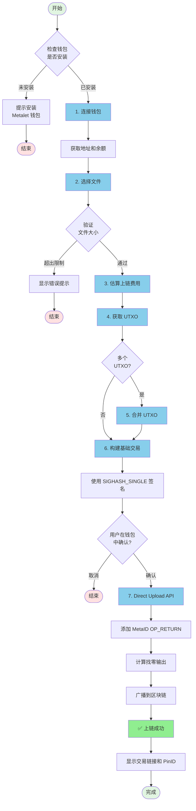

# 📤 MetaID 文件上链流程详解 - Direct Upload 方式

本文档详细说明如何使用 Meta Media Uploader 的 **Direct Upload** 方法（一步上链）将文件上传到区块链。

## 📋 目录

- [流程概览](#流程概览)
- [详细步骤](#详细步骤)
  - [步骤 1: 连接 Metalet 钱包](#步骤-1-连接-metalet-钱包)
  - [步骤 2: 选择文件](#步骤-2-选择文件)
  - [步骤 3: 估算上链费用](#步骤-3-估算上链费用)
  - [步骤 4: 获取 UTXO](#步骤-4-获取-utxo)
  - [步骤 5: 合并 UTXO（如需要）](#步骤-5-合并-utxo如需要)
  - [步骤 6: 构建并签名基础交易](#步骤-6-构建并签名基础交易)
  - [步骤 7: Direct Upload](#步骤-7-direct-upload)
- [API 接口说明](#api-接口说明)
- [代码示例](#代码示例)
- [常见问题](#常见问题)

---

## 🎯 流程概览

Direct Upload 方法是一个**一步**文件上链流程，将构建和广播合并为单个操作。这种方法更高效，减少了钱包交互次数。



---

## 📝 详细步骤

### 步骤 1: 连接 Metalet 钱包

#### 1.1 检查钱包插件

首先检查用户是否已安装 Metalet 钱包浏览器插件：

```javascript
// 检查钱包是否已安装
if (typeof window.metaidwallet === 'undefined') {
    alert('请先安装 Metalet 钱包插件！');
    window.open('https://www.metalet.space/', '_blank');
    return;
}
```

#### 1.2 连接钱包

调用钱包的 `connect()` 方法请求用户授权：

```javascript
// 连接钱包
const account = await window.metaidwallet.connect();

// 获取地址（兼容不同版本的钱包 API）
const address = account.address || account.mvcAddress || account.btcAddress;

console.log('钱包地址:', address);
```

#### 1.3 获取余额

连接成功后，获取用户的钱包余额：

```javascript
// 获取余额
const balance = await window.metaidwallet.getBalance();

console.log('总余额:', balance.total, 'satoshis');
console.log('已确认:', balance.confirmed, 'satoshis');
console.log('未确认:', balance.unconfirmed, 'satoshis');
```

#### 1.4 计算 MetaID

使用地址的 SHA256 哈希作为 MetaID：

```javascript
async function calculateMetaID(address) {
    const encoder = new TextEncoder();
    const data = encoder.encode(address);
    const hashBuffer = await crypto.subtle.digest('SHA-256', data);
    const hashArray = Array.from(new Uint8Array(hashBuffer));
    const hashHex = hashArray.map(b => b.toString(16).padStart(2, '0')).join('');
    return hashHex;
}

const metaId = await calculateMetaID(address);
console.log('MetaID:', metaId);
```

---

### 步骤 2: 选择文件

#### 2.1 文件选择

用户通过拖放或点击选择要上传的文件：

```javascript
// 处理文件选择
function handleFile(file) {
    // 验证文件大小
    if (file.size > maxFileSize) {
        alert(`文件过大！最大限制: ${formatFileSize(maxFileSize)}`);
        return;
    }
    
    selectedFile = file;
    console.log('文件已选择:', file.name, formatFileSize(file.size));
}
```

#### 2.2 构建 ContentType

为文件构建正确的 ContentType（类型 + ;binary 后缀）：

```javascript
// 构建 ContentType
let contentType = file.type || 'application/octet-stream';
if (!contentType.includes(';binary')) {
    contentType = contentType + ';binary';
}

// 示例：
// - image/png → image/png;binary
// - application/pdf → application/pdf;binary
// - text/plain → text/plain;binary
```

---

### 步骤 3: 估算上链费用

根据文件大小和交易结构计算预估的交易费用：

```javascript
async function estimateUploadFee() {
    // 基础交易大小估算
    const baseSize = 200; // 基础交易开销
    const inputSize = 150; // 每个输入大小（含签名）
    const outputSize = 34; // 每个输出大小
    const opReturnOverhead = 50; // OP_RETURN 脚本开销
    
    // 文件大小
    const fileSize = selectedFile.size;
    
    // 计算 OP_RETURN 输出大小
    // MetaID 协议：metaid + operation + path + encryption + version + contentType + content
    const path = document.getElementById('pathInput').value;
    const fileHost = document.getElementById('fileHostInput').value.trim();
    const finalPath = fileHost ? fileHost + ':' + path : path;
    
    const metadataSize = 6 + 10 + finalPath.length + 10 + 10 + 50; // 粗略估算
    const opReturnSize = opReturnOverhead + metadataSize + fileSize;
    
    // 总交易大小估算（1个输入，2个输出：找零 + OP_RETURN）
    const estimatedTxSize = baseSize + inputSize + outputSize * 2 + opReturnSize;
    
    // 获取费率
    const feeRate = Number(document.getElementById('feeRateInput').value) || 1;
    
    // 计算费用
    const estimatedFee = Math.ceil(estimatedTxSize * feeRate);
    
    // 添加安全边际（20%）
    const feeWithMargin = Math.ceil(estimatedFee * 1.2);
    
    console.log('预估交易大小:', estimatedTxSize, 'bytes');
    console.log('费率:', feeRate, 'sat/byte');
    console.log('预估费用（含20%边际）:', feeWithMargin, 'satoshis');
    
    return feeWithMargin;
}
```

---

### 步骤 4: 获取 UTXO

从钱包中获取可用的 UTXO：

```javascript
async function getWalletUTXOs(requiredAmount) {
    try {
        // 从钱包获取 UTXO
        const utxos = await window.metaidwallet.getUtxos();
        
        if (!utxos || utxos.length === 0) {
            throw new Error('钱包中没有可用的 UTXO');
        }

        // 过滤 UTXO：只选择 > 600 satoshis 的 UTXO（确保可以创建找零输出）
        const filler = 600;
        const fillerUtxos = utxos.filter(utxo => utxo.value > filler);
        
        if (!fillerUtxos || fillerUtxos.length === 0) {
            throw new Error('钱包中没有大于 600 satoshis 的 UTXO');
        }

        // 按金额排序（降序）
        const sortedUtxos = fillerUtxos.sort((a, b) => b.value - a.value);
        
        // 获取 meta-contract 库进行地址转换
        const metaContract = window.metaContract;
        const mvc = metaContract.mvc;
        
        // 选择满足所需金额的 UTXO
        let selectedUtxos = [];
        let totalAmount = 0;
        
        for (const utxo of sortedUtxos) {
            // 转换地址为脚本
            let scriptHex = mvc.Script.buildPublicKeyHashOut(utxo.address).toHex();
            selectedUtxos.push({
                txId: utxo.txid,
                outputIndex: utxo.outIndex,
                script: scriptHex,
                satoshis: utxo.value
            });
            totalAmount += utxo.value;
            
            // 为找零输出添加缓冲（接收者 1 satoshi）
            if (totalAmount >= requiredAmount + 1) {
                break;
            }
        }

        if (totalAmount < requiredAmount + 1) {
            throw new Error(`余额不足！需要 ${requiredAmount + 1} satoshis，但只有 ${totalAmount} satoshis`);
        }
        
        return {
            utxos: selectedUtxos,
            totalAmount: totalAmount
        };
    } catch (error) {
        console.error('获取 UTXO 失败:', error);
        throw new Error(`获取 UTXO 失败: ${error.message}`);
    }
}
```

---

### 步骤 5: 合并 UTXO（如需要）

如果检测到多个 UTXO，将它们合并为单个 UTXO 以支持 SIGHASH_SINGLE：

```javascript
async function mergeUTXOs(utxoData, estimatedFee) {
    try {
        // 检查 pay 方法是否可用
        if (typeof window.metaidwallet.pay !== 'function') {
            throw new Error('钱包不支持 pay 方法');
        }
        
        // 获取 meta-contract 库用于 TxComposer
        const metaContract = window.metaContract;
        const mvc = metaContract.mvc;
        const TxComposer = metaContract.TxComposer;
        
        // 创建合并交易 - 我们只指定输出
        // pay 方法会自动选择输入、添加找零并签名
        const mergeTx = new mvc.Transaction();
        mergeTx.version = 10;
        
        // 添加单个输出到我们自己（这将把所有 UTXO 合并为一个）
        mergeTx.to(currentAddress, estimatedFee); 
        
        // 为 pay 方法创建 TxComposer
        const txComposer = new TxComposer(mergeTx);
        const txComposerSerialize = txComposer.serialize();
        
        // 构建 pay 参数
        const feeRate = Number(document.getElementById('feeRateInput').value) || 1;
        const payParams = {
            transactions: [
                {
                    txComposer: txComposerSerialize,
                    message: '合并 UTXO',
                }
            ],
            feeb: feeRate,
        };
        
        // 调用 pay 方法 - 它会自动选择输入、添加找零并签名
        const payResult = await window.metaidwallet.pay(payParams);
        
        // 反序列化已支付的交易
        const payedTxComposerStr = payResult.payedTransactions[0];
        const payedTxComposer = TxComposer.deserialize(payedTxComposerStr);
        
        // 获取签名后的交易 hex
        const signedMergeTxHex = payedTxComposer.getRawHex();
        const mergeTxId = payedTxComposer.getTxId();
        
        // 解析交易以获取输出信息
        const parsedMergeTx = new mvc.Transaction(signedMergeTxHex);
        
        // 找到发送到我们地址的输出（合并后的 UTXO）
        let mergedOutputIndex = -1;
        let mergedOutputAmount = 0;
        
        for (let i = 0; i < parsedMergeTx.outputs.length; i++) {
            const output = parsedMergeTx.outputs[i];
            try {
                const addr = output.script.toAddress(mvc.Networks.livenet);
                if (addr && addr.toString() === currentAddress) {
                    mergedOutputIndex = i;
                    mergedOutputAmount = output.satoshis;
                    break;
                }
            } catch (e) {
                continue;
            }
        }
        
        if (mergedOutputIndex === -1) {
            // 备用方案：使用第一个输出
            mergedOutputIndex = 0;
            mergedOutputAmount = parsedMergeTx.outputs[0].satoshis;
        }
        
        // 从合并交易创建新的 UTXO 信息
        const newUtxo = {
            txId: mergeTxId,
            outputIndex: mergedOutputIndex,
            script: parsedMergeTx.outputs[mergedOutputIndex].script.toHex(),
            satoshis: mergedOutputAmount
        };
        
        return {
            utxos: [newUtxo],
            totalAmount: newUtxo.satoshis,
            mergeTxId: mergeTxId,
            mergeTxHex: signedMergeTxHex
        };
        
    } catch (error) {
        console.error('合并 UTXO 失败:', error);
        throw new Error(`合并 UTXO 失败: ${error.message}`);
    }
}
```

---

### 步骤 6: 构建并签名基础交易

构建一个使用 SIGHASH_SINGLE 签名的基础交易（需要单个 UTXO）：

```javascript
async function buildAndSignBaseTx(utxoData) {
    try {
        // 验证：SIGHASH_SINGLE 需要恰好一个 UTXO
        if (!utxoData.utxos || utxoData.utxos.length !== 1) {
            throw new Error(`SIGHASH_SINGLE 需要恰好 1 个 UTXO，得到 ${utxoData.utxos ? utxoData.utxos.length : 0}`);
        }
        
        // 获取 meta-contract 库
        const metaContract = window.metaContract;
        const mvc = metaContract.mvc;
        
        const utxo = utxoData.utxos[0]; // 单个 UTXO
        
        // 创建新交易
        const tx = new mvc.Transaction();
        tx.version = 10; // MVC 版本
        
        // 添加单个输入
        tx.from({
            txId: utxo.txId,
            outputIndex: utxo.outputIndex,
            script: utxo.script,
            satoshis: utxo.satoshis
        });
        
        // 添加接收者输出（1 satoshi）
        tx.to(currentAddress, 1);
        
        // 序列化为 hex
        const txHex = tx.toString();
        
        // 使用 SIGHASH_SINGLE 签名单个输入
        const signResult = await window.metaidwallet.signTransaction({
            transaction: {
                txHex: tx.toString(),
                address: currentAddress,
                inputIndex: 0,
                scriptHex: utxo.script,
                satoshis: utxo.satoshis,
                sigtype: 0x3 | 0x80 | 0x40 // SIGHASH_SINGLE | ANYONE_CAN_PAY
            }
        });
        
        if (!signResult || !signResult.signature || !signResult.signature.sig) {
            throw new Error('获取签名失败');
        }
        
        // 从签名构建解锁脚本（scriptSig）
        const sig = signResult.signature.sig;
        const publicKey = signResult.signature.publicKey;
        
        // 构建 P2PKH 解锁脚本：<sig> <pubkey>
        const unlockingScript = mvc.Script.buildPublicKeyHashIn(
            publicKey,
            mvc.crypto.Signature.fromTxFormat(Buffer.from(sig, 'hex')).toDER(),
            0x3 | 0x80 | 0x40 // SIGHASH_SINGLE | ANYONE_CAN_PAY
        );

        // 为此输入设置解锁脚本
        tx.inputs[0].setScript(unlockingScript);
        
        // 获取最终签名后的交易 hex
        const signedTxHex = tx.toString();
        
        return signedTxHex;
        
    } catch (error) {
        console.error('构建/签名 MVC 交易失败:', error);
        throw new Error(`构建/签名 MVC 交易失败: ${error.message}`);
    }
}
```

---

### 步骤 7: Direct Upload

将签名后的基础交易提交给 Direct Upload API，它会添加 MetaID OP_RETURN 输出并广播：

```javascript
async function directUpload(preTxHex, totalInputAmount, mergeTxHex) {
    try {
        // 构建 contentType
        let contentType = selectedFile.type || 'application/octet-stream';
        if (!contentType.includes(';binary')) {
            contentType = contentType + ';binary';
        }
        
        const path = document.getElementById('pathInput').value;
        
        // 如果提供了主机信息，添加到路径中
        const fileHost = document.getElementById('fileHostInput').value.trim();
        let finalPath = path;
        if (fileHost) {
            finalPath = fileHost + ':' + path;
        }
        
        const formData = new FormData();
        formData.append('file', selectedFile);
        formData.append('path', finalPath);
        if (mergeTxHex) {
            formData.append('mergeTxHex', mergeTxHex);
        }
        formData.append('preTxHex', preTxHex);
        formData.append('operation', document.getElementById('operationSelect').value);
        formData.append('contentType', contentType);
        formData.append('metaId', await calculateMetaID(currentAddress));
        formData.append('address', currentAddress);
        formData.append('changeAddress', currentAddress);
        formData.append('feeRate', document.getElementById('feeRateInput').value);
        formData.append('totalInputAmount', totalInputAmount.toString());
        
        const response = await fetch(`${API_BASE}/api/v1/files/direct-upload`, {
            method: 'POST',
            body: formData
        });
        
        if (!response.ok) {
            throw new Error(`HTTP 错误: ${response.status}`);
        }
        
        const result = await response.json();
        
        if (result.code !== 0) {
            throw new Error(result.message);
        }
        
        console.log('DirectUpload 成功！');
        console.log('TxID:', result.data.txId);
        console.log('状态:', result.data.status);
        
        return result.data;
    } catch (error) {
        console.error('DirectUpload 失败:', error);
        throw new Error(`DirectUpload 失败: ${error.message}`);
    }
}
```

---

## 🔌 API 接口说明

### Direct Upload

使用一步直接上传方法上传文件。

```http
POST /api/v1/files/direct-upload
Content-Type: multipart/form-data
```

**请求参数：**

| 参数 | 类型 | 必填 | 说明 |
|------|------|------|------|
| file | File | 是 | 要上传的文件 |
| path | String | 是 | 文件路径（如：`/file`） |
| preTxHex | String | 是 | 预签名交易 hex（含输入和输出） |
| mergeTxHex | String | 否 | 合并交易 hex（可选，在主交易之前广播） |
| operation | String | 否 | 操作类型（默认：`create`） |
| contentType | String | 否 | 内容类型（建议加 `;binary` 后缀） |
| metaId | String | 否 | 用户的 MetaID（地址的 SHA256） |
| address | String | 否 | 用户的区块链地址 |
| changeAddress | String | 否 | 找零地址（可选，默认为 address） |
| feeRate | Integer | 否 | 费率（satoshis/byte，默认：1） |
| totalInputAmount | Integer | 否 | 总输入金额（satoshis，用于自动找零计算） |

**响应示例：**

```json
{
    "code": 0,
    "message": "success",
    "data": {
        "fileId": "metaid_abc123",
        "status": "success",
        "txId": "实际的交易ID",
        "pinId": "abc123...i0",
        "message": "success"
    }
}
```

---

## 💻 代码示例

### 完整的 Direct Upload 流程代码

```javascript
/**
 * 完整的直接上传流程
 */
async function uploadFileToChainDirect(file) {
    try {
        // 1. 连接钱包
        const account = await window.metaidwallet.connect();
        const address = account.address || account.mvcAddress;
        const metaId = await calculateMetaID(address);
        
        console.log('✅ 钱包已连接:', address);
        
        // 2. 构建 ContentType
        let contentType = file.type || 'application/octet-stream';
        if (!contentType.includes(';binary')) {
            contentType = contentType + ';binary';
        }
        
        // 3. 估算上链费用
        const estimatedFee = await estimateUploadFee();
        console.log('💰 预估费用:', estimatedFee, 'satoshis');
        
        // 4. 获取 UTXO
        const utxos = await getWalletUTXOs(estimatedFee);
        console.log('✅ 获取到', utxos.utxos.length, '个 UTXO，总计:', utxos.totalAmount, 'satoshis');
        
        // 5. 如需要则合并 UTXO
        let finalUtxo = null;
        let mergeTxHex = '';
        
        if (utxos.utxos.length > 1) {
            console.log('⚠️ 检测到多个 UTXO，正在合并...');
            const mergeResult = await mergeUTXOs(utxos, estimatedFee);
            finalUtxo = {
                utxos: mergeResult.utxos,
                totalAmount: mergeResult.totalAmount
            };
            mergeTxHex = mergeResult.mergeTxHex || '';
            console.log('✅ UTXO 合并成功');
        } else {
            finalUtxo = {
                utxos: utxos.utxos,
                totalAmount: utxos.totalAmount
            };
            console.log('✅ 单个 UTXO，无需合并');
        }
        
        // 6. 构建并签名基础交易
        console.log('请在钱包中确认签名...');
        const preTxHex = await buildAndSignBaseTx(finalUtxo);
        console.log('✅ 基础交易已签名');
        
        // 7. 直接上传（一步：添加 OP_RETURN + 计算找零 + 广播）
        const uploadResult = await directUpload(preTxHex, finalUtxo.totalAmount, mergeTxHex);
        
        console.log('✅ 文件上传成功！');
        console.log('TxID:', uploadResult.txId);
        console.log('PinID:', uploadResult.pinId);
        
        return uploadResult;
        
    } catch (error) {
        console.error('❌ 直接上传失败:', error.message);
        throw error;
    }
}

// 使用示例
const fileInput = document.getElementById('fileInput');
fileInput.addEventListener('change', async (e) => {
    const file = e.target.files[0];
    if (file) {
        try {
            const result = await uploadFileToChainDirect(file);
            alert('上传成功！TxID: ' + result.txId);
        } catch (error) {
            alert('上传失败: ' + error.message);
        }
    }
});
```

---

## ❓ 常见问题

### Q1: Direct Upload 与传统两步方法有什么区别？

**A:** Direct Upload 方法是一个**一步**流程，将构建和广播合并为单个操作：

- **传统方法：** 预上传 → 签名 → 提交上传（3 步）
- **Direct Upload：** 构建基础交易 → 签名 → 直接上传（3 步，但更高效）

Direct Upload 方法的优势：
1. 减少服务器端复杂性
2. 提供更好的 UTXO 管理
3. 支持自动找零计算
4. 更适合 SIGHASH_SINGLE 签名

---

### Q2: 为什么需要合并 UTXO？

**A:** Direct Upload 方法使用 SIGHASH_SINGLE 签名，需要恰好**一个输入**。如果您的钱包有多个 UTXO，需要先将它们合并为单个 UTXO。

**UTXO 合并的好处：**
1. 启用 SIGHASH_SINGLE 兼容性
2. 减少交易复杂性
3. 提高费用计算准确性
4. 更好的找零输出管理

---

### Q3: 费用估算是如何工作的？

**A:** 费用估算考虑以下因素：

```javascript
// 交易大小组件：
const baseSize = 200;        // 基础交易开销
const inputSize = 150;       // 每个输入大小（含签名）
const outputSize = 34;       // 每个输出大小
const opReturnOverhead = 50; // OP_RETURN 脚本开销

// 文件特定计算：
const metadataSize = 6 + 10 + finalPath.length + 10 + 10 + 50;
const opReturnSize = opReturnOverhead + metadataSize + fileSize;

// 总大小估算：
const estimatedTxSize = baseSize + inputSize + outputSize * 2 + opReturnSize;
const estimatedFee = Math.ceil(estimatedTxSize * feeRate);
const feeWithMargin = Math.ceil(estimatedFee * 1.2); // 20% 安全边际
```

---

### Q4: 如果合并交易失败怎么办？

**A:** 如果 UTXO 合并失败：

1. **用户取消：** 流程优雅停止
2. **余额不足：** 显示所需金额的错误消息
3. **网络问题：** 重试机制或回退到传统方法
4. **钱包兼容性：** 检查钱包是否支持 `pay` 方法

---

### Q5: 可以不合并 UTXO 使用 Direct Upload 吗？

**A:** 可以，如果您的钱包恰好有**一个**大于 600 satoshis 的 UTXO，则跳过合并步骤：

```javascript
if (utxos.utxos.length > 1) {
    // 合并 UTXO
    const mergeResult = await mergeUTXOs(utxos, estimatedFee);
    // ...
} else {
    // 单个 UTXO，无需合并
    finalUtxo = {
        utxos: utxos.utxos,
        totalAmount: utxos.totalAmount
    };
}
```

---

### Q6: 找零计算是如何工作的？

**A:** Direct Upload API 自动计算找零：

```javascript
// 服务器端计算：
const changeVal = totalInputAmount - outAmount - txFee;

if (changeVal >= 600) {
    // 添加找零输出
    tx.TxOut[len(tx.TxOut)-1].Value = changeVal;
} else {
    // 如果找零太小则移除找零输出
    tx.TxOut = tx.TxOut[:len(tx.TxOut)-1];
}
```

**添加找零输出的条件：**
- 找零金额 ≥ 600 satoshis
- 扣除费用后有足够的输入金额

---

### Q7: 如果文件已存在怎么办？

**A:** Direct Upload API 会检查现有文件：

```javascript
// 服务器端检查：
var existingFile model.File
err := dbTx.Where("file_id = ?", fileId).First(&existingFile).Error

if err == nil && existingFile.Status == model.StatusSuccess {
    // 文件已存在且已成功上传
    return existingFile.TxID, existingFile.PinId
}
```

如果文件存在，它会返回现有的交易 ID 和 Pin ID，而不会重新上传。

---

## 🔗 相关链接

- **Metalet 钱包下载：** https://www.metalet.space/
- **MetaID 文档：** https://docs.metaid.io/
- **MVC 区块链浏览器：** https://www.mvcscan.com/
- **MetaID Pin 浏览器：** https://man.metaid.io/
- **GitHub 仓库：** https://github.com/metaid-developers/meta-media-service

---

## 📞 技术支持

如有问题，请联系：

- 提交 Issue: https://github.com/metaid-developers/meta-media-service/issues

---

**最后更新时间：** 2025-01-17
