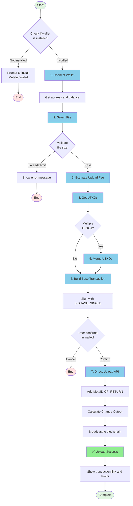

# 📤 MetaID File Upload to Chain - Direct Upload Guide

This document provides a detailed explanation of how to upload files to the blockchain using Meta Media Uploader's **Direct Upload** method (one-step upload).

**[中文版 / Chinese Version](./UPLOAD_FLOW_DIRECT-ZH.md)**

## 📋 Table of Contents

- [Process Overview](#process-overview)
- [Detailed Steps](#detailed-steps)
  - [Step 1: Connect Metalet Wallet](#step-1-connect-metalet-wallet)
  - [Step 2: Select File](#step-2-select-file)
  - [Step 3: Estimate Upload Fee](#step-3-estimate-upload-fee)
  - [Step 4: Get UTXOs](#step-4-get-utxos)
  - [Step 5: Merge UTXOs (if needed)](#step-5-merge-utxos-if-needed)
  - [Step 6: Build and Sign Base Transaction](#step-6-build-and-sign-base-transaction)
  - [Step 7: Direct Upload](#step-7-direct-upload)
- [API Reference](#api-reference)
- [Code Examples](#code-examples)
- [FAQ](#faq)

---

## 🎯 Process Overview

The Direct Upload method is a **one-step** file upload process that combines building and broadcasting into a single operation. This method is more efficient and reduces the number of wallet interactions.



---

## 📝 Detailed Steps

### Step 1: Connect Metalet Wallet

#### 1.1 Check Wallet Extension

First, check if the user has installed the Metalet wallet browser extension:

```javascript
// Check if wallet is installed
if (typeof window.metaidwallet === 'undefined') {
    alert('Please install Metalet wallet extension first!');
    window.open('https://www.metalet.space/', '_blank');
    return;
}
```

#### 1.2 Connect to Wallet

Call the wallet's `connect()` method to request user authorization:

```javascript
// Connect wallet
const account = await window.metaidwallet.connect();

// Get address (compatible with different wallet API versions)
const address = account.address || account.mvcAddress || account.btcAddress;

console.log('Wallet address:', address);
```

#### 1.3 Get Balance

After successful connection, retrieve the user's wallet balance:

```javascript
// Get balance
const balance = await window.metaidwallet.getBalance();

console.log('Total balance:', balance.total, 'satoshis');
console.log('Confirmed:', balance.confirmed, 'satoshis');
console.log('Unconfirmed:', balance.unconfirmed, 'satoshis');
```

#### 1.4 Calculate MetaID

Use the SHA256 hash of the address as the MetaID:

```javascript
async function calculateMetaID(address) {
    const encoder = new TextEncoder();
    const data = encoder.encode(address);
    const hashBuffer = await crypto.subtle.digest('SHA-256', data);
    const hashArray = Array.from(new Uint8Array(hashBuffer));
    const hashHex = hashArray.map(b => b.toString(16).padStart(2, '0')).join('');
    return hashHex;
}

const metaId = await calculateMetaID(address);
console.log('MetaID:', metaId);
```

---

### Step 2: Select File

#### 2.1 File Selection

Users select files to upload via drag-and-drop or clicking:

```javascript
// Handle file selection
function handleFile(file) {
    // Validate file size
    if (file.size > maxFileSize) {
        alert(`File too large! Maximum limit: ${formatFileSize(maxFileSize)}`);
        return;
    }
    
    selectedFile = file;
    console.log('File selected:', file.name, formatFileSize(file.size));
}
```

#### 2.2 Build ContentType

Build the correct ContentType for the file (type + ;binary suffix):

```javascript
// Build ContentType
let contentType = file.type || 'application/octet-stream';
if (!contentType.includes(';binary')) {
    contentType = contentType + ';binary';
}

// Examples:
// - image/png → image/png;binary
// - application/pdf → application/pdf;binary
// - text/plain → text/plain;binary
```

---

### Step 3: Estimate Upload Fee

Calculate the estimated transaction fee based on file size and transaction structure:

```javascript
async function estimateUploadFee() {
    // Base transaction size estimation
    const baseSize = 200; // Basic transaction overhead
    const inputSize = 150; // Per input size (with signature)
    const outputSize = 34; // Per output size
    const opReturnOverhead = 50; // OP_RETURN script overhead
    
    // File size
    const fileSize = selectedFile.size;
    
    // Calculate OP_RETURN output size
    // MetaID protocol: metaid + operation + path + encryption + version + contentType + content
    const path = document.getElementById('pathInput').value;
    const fileHost = document.getElementById('fileHostInput').value.trim();
    const finalPath = fileHost ? fileHost + ':' + path : path;
    
    const metadataSize = 6 + 10 + finalPath.length + 10 + 10 + 50; // Rough estimate
    const opReturnSize = opReturnOverhead + metadataSize + fileSize;
    
    // Total transaction size estimation (1 input, 2 outputs: change + OP_RETURN)
    const estimatedTxSize = baseSize + inputSize + outputSize * 2 + opReturnSize;
    
    // Get fee rate
    const feeRate = Number(document.getElementById('feeRateInput').value) || 1;
    
    // Calculate fee
    const estimatedFee = Math.ceil(estimatedTxSize * feeRate);
    
    // Add safety margin (20%)
    const feeWithMargin = Math.ceil(estimatedFee * 1.2);
    
    console.log('Estimated tx size:', estimatedTxSize, 'bytes');
    console.log('Fee rate:', feeRate, 'sat/byte');
    console.log('Estimated fee (with 20% margin):', feeWithMargin, 'satoshis');
    
    return feeWithMargin;
}
```

---

### Step 4: Get UTXOs

Retrieve available UTXOs from the wallet:

```javascript
async function getWalletUTXOs(requiredAmount) {
    try {
        // Get UTXOs from wallet
        const utxos = await window.metaidwallet.getUtxos();
        
        if (!utxos || utxos.length === 0) {
            throw new Error('No available UTXOs in wallet');
        }

        // Filter UTXOs: only select UTXOs > 600 satoshis (to ensure change output is possible)
        const filler = 600;
        const fillerUtxos = utxos.filter(utxo => utxo.value > filler);
        
        if (!fillerUtxos || fillerUtxos.length === 0) {
            throw new Error('No UTXOs larger than 600 satoshis available in wallet');
        }

        // Sort UTXOs by amount (descending)
        const sortedUtxos = fillerUtxos.sort((a, b) => b.value - a.value);
        
        // Get meta-contract library for address conversion
        const metaContract = window.metaContract;
        const mvc = metaContract.mvc;
        
        // Select UTXOs to meet required amount
        let selectedUtxos = [];
        let totalAmount = 0;
        
        for (const utxo of sortedUtxos) {
            // Convert address to script
            let scriptHex = mvc.Script.buildPublicKeyHashOut(utxo.address).toHex();
            selectedUtxos.push({
                txId: utxo.txid,
                outputIndex: utxo.outIndex,
                script: scriptHex,
                satoshis: utxo.value
            });
            totalAmount += utxo.value;
            
            // Add buffer for change output (1 satoshi for receiver)
            if (totalAmount >= requiredAmount + 1) {
                break;
            }
        }

        if (totalAmount < requiredAmount + 1) {
            throw new Error(`Insufficient balance! Need ${requiredAmount + 1} satoshis, but only have ${totalAmount} satoshis`);
        }
        
        return {
            utxos: selectedUtxos,
            totalAmount: totalAmount
        };
    } catch (error) {
        console.error('Failed to get UTXOs:', error);
        throw new Error(`Failed to get UTXOs: ${error.message}`);
    }
}
```

---

### Step 5: Merge UTXOs (if needed)

If multiple UTXOs are detected, merge them into a single UTXO for SIGHASH_SINGLE compatibility:

```javascript
async function mergeUTXOs(utxoData, estimatedFee) {
    try {
        // Check if pay method is available
        if (typeof window.metaidwallet.pay !== 'function') {
            throw new Error('Wallet does not support pay method');
        }
        
        // Get meta-contract library for TxComposer
        const metaContract = window.metaContract;
        const mvc = metaContract.mvc;
        const TxComposer = metaContract.TxComposer;
        
        // Create merge transaction - we only specify the output
        // pay method will automatically select inputs, add change, and sign
        const mergeTx = new mvc.Transaction();
        mergeTx.version = 10;
        
        // Add single output to ourselves (this will merge all UTXOs into one)
        mergeTx.to(currentAddress, estimatedFee); 
        
        // Create TxComposer for pay method
        const txComposer = new TxComposer(mergeTx);
        const txComposerSerialize = txComposer.serialize();
        
        // Build pay params
        const feeRate = Number(document.getElementById('feeRateInput').value) || 1;
        const payParams = {
            transactions: [
                {
                    txComposer: txComposerSerialize,
                    message: 'Merge UTXOs',
                }
            ],
            feeb: feeRate,
        };
        
        // Call pay method - it will auto select inputs, add change, and sign
        const payResult = await window.metaidwallet.pay(payParams);
        
        // Deserialize the payed transaction
        const payedTxComposerStr = payResult.payedTransactions[0];
        const payedTxComposer = TxComposer.deserialize(payedTxComposerStr);
        
        // Get signed transaction hex
        const signedMergeTxHex = payedTxComposer.getRawHex();
        const mergeTxId = payedTxComposer.getTxId();
        
        // Parse the transaction to get output info
        const parsedMergeTx = new mvc.Transaction(signedMergeTxHex);
        
        // Find the output that goes to our address (the merged UTXO)
        let mergedOutputIndex = -1;
        let mergedOutputAmount = 0;
        
        for (let i = 0; i < parsedMergeTx.outputs.length; i++) {
            const output = parsedMergeTx.outputs[i];
            try {
                const addr = output.script.toAddress(mvc.Networks.livenet);
                if (addr && addr.toString() === currentAddress) {
                    mergedOutputIndex = i;
                    mergedOutputAmount = output.satoshis;
                    break;
                }
            } catch (e) {
                continue;
            }
        }
        
        if (mergedOutputIndex === -1) {
            // Fallback: use the first output
            mergedOutputIndex = 0;
            mergedOutputAmount = parsedMergeTx.outputs[0].satoshis;
        }
        
        // Create new UTXO info from merge transaction
        const newUtxo = {
            txId: mergeTxId,
            outputIndex: mergedOutputIndex,
            script: parsedMergeTx.outputs[mergedOutputIndex].script.toHex(),
            satoshis: mergedOutputAmount
        };
        
        return {
            utxos: [newUtxo],
            totalAmount: newUtxo.satoshis,
            mergeTxId: mergeTxId,
            mergeTxHex: signedMergeTxHex
        };
        
    } catch (error) {
        console.error('Failed to merge UTXOs:', error);
        throw new Error(`Failed to merge UTXOs: ${error.message}`);
    }
}
```

---

### Step 6: Build and Sign Base Transaction

Build a base transaction with SIGHASH_SINGLE signature (requires single UTXO):

```javascript
async function buildAndSignBaseTx(utxoData) {
    try {
        // Validate: must have exactly one UTXO for SIGHASH_SINGLE
        if (!utxoData.utxos || utxoData.utxos.length !== 1) {
            throw new Error(`SIGHASH_SINGLE requires exactly 1 UTXO, got ${utxoData.utxos ? utxoData.utxos.length : 0}`);
        }
        
        // Get meta-contract library
        const metaContract = window.metaContract;
        const mvc = metaContract.mvc;
        
        const utxo = utxoData.utxos[0]; // Single UTXO
        
        // Create new transaction
        const tx = new mvc.Transaction();
        tx.version = 10; // MVC version
        
        // Add single input
        tx.from({
            txId: utxo.txId,
            outputIndex: utxo.outputIndex,
            script: utxo.script,
            satoshis: utxo.satoshis
        });
        
        // Add receiver output (1 satoshi)
        tx.to(currentAddress, 1);
        
        // Serialize to hex
        const txHex = tx.toString();
        
        // Sign the single input with SIGHASH_SINGLE
        const signResult = await window.metaidwallet.signTransaction({
            transaction: {
                txHex: tx.toString(),
                address: currentAddress,
                inputIndex: 0,
                scriptHex: utxo.script,
                satoshis: utxo.satoshis,
                sigtype: 0x3 | 0x80 | 0x40 // SIGHASH_SINGLE | ANYONE_CAN_PAY
            }
        });
        
        if (!signResult || !signResult.signature || !signResult.signature.sig) {
            throw new Error('Failed to get signature');
        }
        
        // Build unlocking script (scriptSig) from signature
        const sig = signResult.signature.sig;
        const publicKey = signResult.signature.publicKey;
        
        // Build P2PKH unlocking script: <sig> <pubkey>
        const unlockingScript = mvc.Script.buildPublicKeyHashIn(
            publicKey,
            mvc.crypto.Signature.fromTxFormat(Buffer.from(sig, 'hex')).toDER(),
            0x3 | 0x80 | 0x40 // SIGHASH_SINGLE | ANYONE_CAN_PAY
        );

        // Set the unlocking script for this input
        tx.inputs[0].setScript(unlockingScript);
        
        // Get final signed transaction hex
        const signedTxHex = tx.toString();
        
        return signedTxHex;
        
    } catch (error) {
        console.error('Failed to build/sign MVC transaction:', error);
        throw new Error(`Failed to build/sign MVC transaction: ${error.message}`);
    }
}
```

---

### Step 7: Direct Upload

Submit the signed base transaction to the Direct Upload API, which will add the MetaID OP_RETURN output and broadcast:

```javascript
async function directUpload(preTxHex, totalInputAmount, mergeTxHex) {
    try {
        // Build contentType
        let contentType = selectedFile.type || 'application/octet-stream';
        if (!contentType.includes(';binary')) {
            contentType = contentType + ';binary';
        }
        
        const path = document.getElementById('pathInput').value;
        
        // Add host information to path if provided
        const fileHost = document.getElementById('fileHostInput').value.trim();
        let finalPath = path;
        if (fileHost) {
            finalPath = fileHost + ':' + path;
        }
        
        const formData = new FormData();
        formData.append('file', selectedFile);
        formData.append('path', finalPath);
        if (mergeTxHex) {
            formData.append('mergeTxHex', mergeTxHex);
        }
        formData.append('preTxHex', preTxHex);
        formData.append('operation', document.getElementById('operationSelect').value);
        formData.append('contentType', contentType);
        formData.append('metaId', await calculateMetaID(currentAddress));
        formData.append('address', currentAddress);
        formData.append('changeAddress', currentAddress);
        formData.append('feeRate', document.getElementById('feeRateInput').value);
        formData.append('totalInputAmount', totalInputAmount.toString());
        
        const response = await fetch(`${API_BASE}/api/v1/files/direct-upload`, {
            method: 'POST',
            body: formData
        });
        
        if (!response.ok) {
            throw new Error(`HTTP Error: ${response.status}`);
        }
        
        const result = await response.json();
        
        if (result.code !== 0) {
            throw new Error(result.message);
        }
        
        console.log('DirectUpload success!');
        console.log('TxID:', result.data.txId);
        console.log('Status:', result.data.status);
        
        return result.data;
    } catch (error) {
        console.error('DirectUpload failed:', error);
        throw new Error(`DirectUpload failed: ${error.message}`);
    }
}
```

---

## 🔌 API Reference

### Direct Upload

Upload file using the one-step direct upload method.

```http
POST /api/v1/files/direct-upload
Content-Type: multipart/form-data
```

**Request Parameters:**

| Parameter | Type | Required | Description |
|-----------|------|----------|-------------|
| file | File | Yes | File to upload |
| path | String | Yes | File path (e.g., `/file`) |
| preTxHex | String | Yes | Pre-signed transaction hex (with inputs and outputs) |
| mergeTxHex | String | No | Merge transaction hex (optional, broadcasted before main transaction) |
| operation | String | No | Operation type (default: `create`) |
| contentType | String | No | Content type (recommended with `;binary` suffix) |
| metaId | String | No | User's MetaID (SHA256 of address) |
| address | String | No | User's blockchain address |
| changeAddress | String | No | Change address (optional, defaults to address) |
| feeRate | Integer | No | Fee rate (satoshis/byte, default: 1) |
| totalInputAmount | Integer | No | Total input amount in satoshis (for automatic change calculation) |

**Response Example:**

```json
{
    "code": 0,
    "message": "success",
    "data": {
        "fileId": "metaid_abc123",
        "status": "success",
        "txId": "actual transaction ID",
        "pinId": "abc123...i0",
        "message": "success"
    }
}
```

---

## 💻 Code Examples

### Complete Direct Upload Flow Code

```javascript
/**
 * Complete direct upload flow
 */
async function uploadFileToChainDirect(file) {
    try {
        // 1. Connect wallet
        const account = await window.metaidwallet.connect();
        const address = account.address || account.mvcAddress;
        const metaId = await calculateMetaID(address);
        
        console.log('✅ Wallet connected:', address);
        
        // 2. Build ContentType
        let contentType = file.type || 'application/octet-stream';
        if (!contentType.includes(';binary')) {
            contentType = contentType + ';binary';
        }
        
        // 3. Estimate upload fee
        const estimatedFee = await estimateUploadFee();
        console.log('💰 Estimated fee:', estimatedFee, 'satoshis');
        
        // 4. Get UTXOs
        const utxos = await getWalletUTXOs(estimatedFee);
        console.log('✅ Got', utxos.utxos.length, 'UTXO(s), total:', utxos.totalAmount, 'satoshis');
        
        // 5. Merge UTXOs if needed
        let finalUtxo = null;
        let mergeTxHex = '';
        
        if (utxos.utxos.length > 1) {
            console.log('⚠️ Multiple UTXOs detected, merging...');
            const mergeResult = await mergeUTXOs(utxos, estimatedFee);
            finalUtxo = {
                utxos: mergeResult.utxos,
                totalAmount: mergeResult.totalAmount
            };
            mergeTxHex = mergeResult.mergeTxHex || '';
            console.log('✅ UTXOs merged successfully');
        } else {
            finalUtxo = {
                utxos: utxos.utxos,
                totalAmount: utxos.totalAmount
            };
            console.log('✅ Single UTXO, no merge needed');
        }
        
        // 6. Build and sign base transaction
        console.log('Please confirm signature in wallet...');
        const preTxHex = await buildAndSignBaseTx(finalUtxo);
        console.log('✅ Base transaction signed');
        
        // 7. Direct upload (one-step: add OP_RETURN + calculate change + broadcast)
        const uploadResult = await directUpload(preTxHex, finalUtxo.totalAmount, mergeTxHex);
        
        console.log('✅ File uploaded successfully!');
        console.log('TxID:', uploadResult.txId);
        console.log('PinID:', uploadResult.pinId);
        
        return uploadResult;
        
    } catch (error) {
        console.error('❌ Direct upload failed:', error.message);
        throw error;
    }
}

// Usage example
const fileInput = document.getElementById('fileInput');
fileInput.addEventListener('change', async (e) => {
    const file = e.target.files[0];
    if (file) {
        try {
            const result = await uploadFileToChainDirect(file);
            alert('Upload successful! TxID: ' + result.txId);
        } catch (error) {
            alert('Upload failed: ' + error.message);
        }
    }
});
```

---

## ❓ FAQ

### Q1: What is the difference between Direct Upload and the traditional two-step method?

**A:** The Direct Upload method is a **one-step** process that combines building and broadcasting into a single operation:

- **Traditional Method:** Pre-upload → Sign → Commit upload (3 steps)
- **Direct Upload:** Build base transaction → Sign → Direct upload (3 steps, but more efficient)

The Direct Upload method:
1. Reduces server-side complexity
2. Provides better UTXO management
3. Supports automatic change calculation
4. Is more suitable for SIGHASH_SINGLE signatures

---

### Q2: Why do we need to merge UTXOs?

**A:** The Direct Upload method uses SIGHASH_SINGLE signatures, which require exactly **one input**. If your wallet has multiple UTXOs, they need to be merged into a single UTXO first.

**Benefits of UTXO merging:**
1. Enables SIGHASH_SINGLE compatibility
2. Reduces transaction complexity
3. Improves fee calculation accuracy
4. Better change output management

---

### Q3: How does the fee estimation work?

**A:** The fee estimation considers:

```javascript
// Transaction size components:
const baseSize = 200;        // Basic transaction overhead
const inputSize = 150;       // Per input size (with signature)
const outputSize = 34;       // Per output size
const opReturnOverhead = 50; // OP_RETURN script overhead

// File-specific calculation:
const metadataSize = 6 + 10 + finalPath.length + 10 + 10 + 50;
const opReturnSize = opReturnOverhead + metadataSize + fileSize;

// Total size estimation:
const estimatedTxSize = baseSize + inputSize + outputSize * 2 + opReturnSize;
const estimatedFee = Math.ceil(estimatedTxSize * feeRate);
const feeWithMargin = Math.ceil(estimatedFee * 1.2); // 20% safety margin
```

---

### Q4: What happens if the merge transaction fails?

**A:** If UTXO merging fails:

1. **User cancellation:** The process stops gracefully
2. **Insufficient balance:** Error message with required amount
3. **Network issues:** Retry mechanism or fallback to traditional method
4. **Wallet compatibility:** Check if wallet supports `pay` method

---

### Q5: Can I use Direct Upload without UTXO merging?

**A:** Yes, if your wallet has exactly **one UTXO** larger than 600 satoshis, the merge step is skipped:

```javascript
if (utxos.utxos.length > 1) {
    // Merge UTXOs
    const mergeResult = await mergeUTXOs(utxos, estimatedFee);
    // ...
} else {
    // Single UTXO, no merge needed
    finalUtxo = {
        utxos: utxos.utxos,
        totalAmount: utxos.totalAmount
    };
}
```

---

### Q6: How does change calculation work?

**A:** The Direct Upload API automatically calculates change:

```javascript
// Server-side calculation:
const changeVal = totalInputAmount - outAmount - txFee;

if (changeVal >= 600) {
    // Add change output
    tx.TxOut[len(tx.TxOut)-1].Value = changeVal;
} else {
    // Remove change output if too small
    tx.TxOut = tx.TxOut[:len(tx.TxOut)-1];
}
```

**Change output is added if:**
- Change value ≥ 600 satoshis
- Sufficient input amount after fees

---

### Q7: What if the file already exists?

**A:** The Direct Upload API checks for existing files:

```javascript
// Server-side check:
var existingFile model.File
err := dbTx.Where("file_id = ?", fileId).First(&existingFile).Error

if err == nil && existingFile.Status == model.StatusSuccess {
    // File already exists and uploaded successfully
    return existingFile.TxID, existingFile.PinId
}
```

If the file exists, it returns the existing transaction ID and Pin ID without re-uploading.

---

## 🔗 Related Links

- **Metalet Wallet Download:** https://www.metalet.space/
- **MetaID Documentation:** https://docs.metaid.io/
- **MVC Blockchain Explorer:** https://www.mvcscan.com/
- **MetaID Pin Explorer:** https://man.metaid.io/
- **GitHub Repository:** https://github.com/metaid-developers/meta-media-service

---

## 📞 Technical Support

For questions, please contact:

- Submit Issue: https://github.com/metaid-developers/meta-media-service/issues

---

**Last Updated:** 2025-01-17
